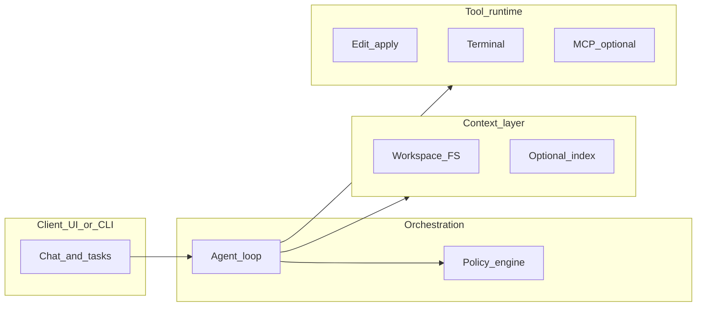

# Codegen Agent — Requirements Specification

**Version:** 1.1  
**Status:** Draft for implementation  
**Audience:** Product, engineering, security, and platform owners  

This document specifies functional and non-functional requirements for building an **autonomous coding agent** comparable in *capabilities* (not necessarily UI or exact product parity) to Cursor’s coding agent: natural-language goals, workspace-grounded context, tool use in a multi-step loop, auditable edits, optional verification, and policy-aware execution.

---

## 1. Purpose and scope

### 1.1 Purpose

Define a testable baseline so multiple implementations (CLI, local service, IDE plugin) can share:

- A common understanding of **behaviors** and **safety boundaries**
- **Tool contracts** and event shapes for integration
- A **phased roadmap** from read-only assistant to full agent

### 1.2 In scope

- Workspace-tied tasks and **context acquisition** (filesystem, search, optional index)
- **Agent orchestration** (plan–act–observe loop, streaming, limits)
- **Tool runtime** (read, search, edit, terminal, optional web/MCP)
- **Human-in-the-loop** and **policy** gates for risky operations
- **Session** model, observability, and configuration
- **Cross-platform** filesystem and subprocess semantics (Windows, macOS, Linux)

### 1.3 Out of scope (unless explicitly expanded later)

- A full IDE or editor fork
- Training or fine-tuning proprietary models
- Legal review of third-party or user code
- Guaranteed equivalence to any commercial product’s UX or model routing

---

## 2. Goals and non-goals

### 2.1 Goals

| ID | Goal |
|----|------|
| G-1 | **Correctness**: Changes reflect user intent and remain consistent with existing project conventions when rules are provided. |
| G-2 | **Grounding**: Answers and edits are justified by **retrieved workspace context**, not only model priors. |
| G-3 | **Auditability**: Every file change and significant command is **recorded** (diff, path, exit code where applicable). |
| G-4 | **Safety**: Destructive or sensitive operations require **explicit policy** (auto-allow, deny, or human approval). |
| G-5 | **Operability**: Failures (permissions, disk, network, tool errors) surface clearly; the agent can **recover** or **stop with a clear ask**. |

### 2.2 Non-goals

| ID | Non-goal |
|----|----------|
| NG-1 | Pixel-perfect parity with Cursor’s UI, shortcuts, or proprietary features. |
| NG-2 | Mandatory cloud-only deployment; implementations may run **fully local** with local models. |
| NG-3 | Solving arbitrary security of user-supplied code execution beyond stated sandbox/policy requirements. |

---

## 3. Stakeholders and use cases

### 3.1 Stakeholders

- **Developer**: Submits tasks, reviews diffs, approves risky steps.
- **Team lead / policy owner**: Defines allowed commands, network, and edit patterns.
- **Platform owner**: Deploys the agent, configures secrets, log retention, and quotas.

### 3.2 Primary use cases

1. **Feature implementation** — Add or change behavior across multiple files with tests/docs.
2. **Bugfix** — Reproduce from description or failing output; patch and verify.
3. **Refactor** — Rename/move modules; preserve behavior; run checks.
4. **Test addition** — Cover edge cases; follow existing test layout.
5. **Dependency upgrade** — Update manifests, fix breakage, run build/test.
6. **Doc/code sync** — Align README or API docs with code.

---

## 4. Functional requirements

Requirements are **numbered** for traceability. “Must” indicates mandatory for a **complete** implementation per phase (see Section 8); phase tags note the **first** phase where the capability is required.

### 4.1 Task understanding and decomposition (FR-Task)

| ID | Requirement | Phase |
|----|-------------|-------|
| FR-TASK-1 | The system **must** accept a natural-language **task** plus a **workspace root** (directory path or equivalent). | 0 |
| FR-TASK-2 | The system **must** interpret the task as one or more **goals** and optional **constraints** (e.g. languages, “do not run tests”). | 0 |
| FR-TASK-3 | The system **should** ask **clarifying questions** when critical information is missing (e.g. unspecified API version, ambiguous file). | 1 |
| FR-TASK-4 | The system **must** support explicit **stop conditions**: success, blocked (need user input), policy denial, or iteration/time budget exceeded. | 0 |
| FR-TASK-5 | The system **should** produce an internal or user-visible **plan** before extensive edits in execution mode (may be skipped in read-only mode). | 1 |

### 4.2 Context and retrieval (FR-Context)

| ID | Requirement | Phase |
|----|-------------|-------|
| FR-CTX-1 | The system **must** resolve all file paths **relative to workspace root** and **reject** path traversal (`..`, symlinks escaping root if policy disallows). | 0 |
| FR-CTX-2 | The system **must** support **listing** directory contents with depth and entry limits configurable. | 0 |
| FR-CTX-3 | The system **must** support **reading file contents** with optional line range or byte cap to enforce token budgets. | 0 |
| FR-CTX-4 | The system **must** provide **text search** (regex-capable, ripgrep-like semantics preferred) over the workspace with include/exclude globs. | 0 |
| FR-CTX-5 | The system **should** respect **`.gitignore`** (and optional custom ignore files) when indexing or searching, configurable. | 1 |
| FR-CTX-6 | The system **may** support **semantic retrieval** (embedding index) over code and docs; if present, **must** document freshness and scope. | 2 |
| FR-CTX-7 | The system **must** enforce **maximum context size** (tokens or bytes) and define **truncation/summarization** behavior when exceeded. | 0 |
| FR-CTX-8 | The system **should** expose which files/snippets were **included in context** in logs or streamed metadata for debuggability. | 1 |

### 4.3 Tooling (FR-Tools)

| ID | Requirement | Phase |
|----|-------------|-------|
| FR-TOOL-1 | The system **must** expose tools to the model via a **stable schema** (names, parameters, descriptions). | 0 |
| FR-TOOL-2 | **read_file**: Read a file under workspace with encoding detection or UTF-8 default; support offset/limit. | 0 |
| FR-TOOL-3 | **list_dir**: List files/directories with optional glob and depth limit. | 0 |
| FR-TOOL-4 | **grep / search**: Search contents with pattern, path scope, context lines, max matches. | 0 |
| FR-TOOL-5 | **apply_patch** (or equivalent structured edit): Apply a unified diff or structured hunks to one or more files; **must** return per-file success/failure. | 1 |
| FR-TOOL-6 | **run_terminal_cmd**: Execute a shell command with cwd under workspace (or allowlisted paths), timeout, and capture stdout/stderr/exit code. | 1 |
| FR-TOOL-7 | Command execution **must** be subject to **policy** (allowlist/denylist patterns, require_approval for sensitive patterns). | 1 |
| FR-TOOL-8 | The system **may** support **web_fetch** (HTTP GET with size/time limits) for documentation or version info. | 2 |
| FR-TOOL-9 | The system **may** support **MCP** (Model Context Protocol) tools with the same policy and audit rules as first-party tools. | 3 |

### 4.4 Agent loop and streaming (FR-Agent)

| ID | Requirement | Phase |
|----|-------------|-------|
| FR-AGENT-1 | The system **must** implement a **loop**: model proposes tool calls → runtime executes → results appended to context → repeat until done or limit hit. | 0 |
| FR-AGENT-2 | The system **must** enforce **max_iterations** and **max_wall_clock** (or equivalent) per task. | 0 |
| FR-AGENT-3 | The system **must** handle **tool errors** (non-zero exit, patch failure, I/O error) and surface them to the model without silent drop. | 0 |
| FR-AGENT-4 | The system **should** stream **user-visible events**: assistant text deltas, tool call start/end, and summarized results (not necessarily raw huge outputs). | 0 |
| FR-AGENT-5 | The system **should** prefer **idempotent** edits when retrying (e.g. detect already-applied hunks) where patch format allows. | 1 |

### 4.5 Edits and patches (FR-Edit)

| ID | Requirement | Phase |
|----|-------------|-------|
| FR-EDIT-1 | All writes **must** be traceable to a **patch or explicit replace** operation logged with path and revision/hash if available. | 1 |
| FR-EDIT-2 | Patch application **must** validate paths stay within workspace unless policy explicitly allows broader paths. | 1 |
| FR-EDIT-3 | The system **must** define **newline** and **encoding** policy (e.g. preserve existing; normalize on request). | 1 |
| FR-EDIT-4 | On **hunk mismatch**, the system **must** return a clear error; **should** offer re-read of current file content for retry. | 1 |
| FR-EDIT-5 | **Multi-file atomic apply** is **desirable**; if not supported, the system **must** document **partial apply** behavior and leave workspace consistent (e.g. transaction per file with rollback best-effort). | 1 |

#### 4.5.1 `apply_patch` — multi-file partial apply (this CLI)

The following is the **documented behavior** of the `apply_patch` tool in this repository (FR-EDIT-5, story P1-03). It is **not** a multi-file atomic transaction.

| Behavior | Description |
|----------|-------------|
| **Across files** | There is **no** all-or-nothing apply: some paths in `files` may succeed and others fail in the same call. |
| **Order** | The `files` array is processed **in order** (index 0, then 1, …). |
| **After a failure** | Processing **does not stop**: if file *i* fails, file *i+1* is still attempted. |
| **Per file** | For each path, the tool reads the current content (or starts empty for create), applies hunks **in memory**, then performs **one write**. If hunks fail for that path, **that file is left unchanged on disk** (no partial write of half-applied hunks). |
| **Result JSON** | `files` mirrors the **input order**. Each entry has `ok` plus success fields or `error`. Top-level `ok` is `true` only if **all** entries succeeded. If any entry failed, top-level `ok` is `false`. The field `partial` is included when there was any failure: it is `true` if **at least one** entry succeeded and **at least one** failed; `false` if **every** entry failed. If **all** entries succeeded, `partial` is **omitted**. |

### 4.6 Verification (FR-Verify)

| ID | Requirement | Phase |
|----|-------------|-------|
| FR-VER-1 | The system **should** allow configuration of **post-edit hooks**: formatter, linter, test command. | 2 |
| FR-VER-2 | Hook **stdout/stderr** and exit codes **must** be visible to the model or user in logs/stream. | 2 |
| FR-VER-3 | Policy **must** define whether failed hooks **block** completion or **warn only**. | 2 |

### 4.7 Human-in-the-loop and modes (FR-HITL)

| ID | Requirement | Phase |
|----|-------------|-------|
| FR-HITL-1 | The system **must** support at least two **modes**: **plan** (read-only tools only; no writes or mutating commands) and **execute** (full toolset per policy). | 1 |
| FR-HITL-2 | Operations matching **sensitive categories** (e.g. `git push`, `rm -rf`, package publish, arbitrary network) **must** require **approval** when policy mandates. | 1 |
| FR-HITL-3 | The system **must** log **approval decisions** (approved/denied/skipped) with timestamp and actor if available. | 1 |
| FR-HITL-4 | The system **should** support **dry-run** for applicable tools (e.g. show patch without apply). | 2 |

### 4.8 Session and persistence (FR-Session)

| ID | Requirement | Phase |
|----|-------------|-------|
| FR-SESS-1 | The system **must** maintain **conversation history** (user messages, assistant messages, tool calls and results) for the duration of a session. | 0 |
| FR-SESS-2 | The system **should** support **session persistence** (resume after restart) when a backing store is configured. | 2 |
| FR-SESS-3 | The system **should** support **history compaction** or summarization when approaching context limits, with explicit rules for what is dropped vs preserved. | 2 |
| FR-SESS-4 | The system **must** support exporting or logging a **reproducible trace** (ordered events sufficient to replay tool inputs/outputs for debugging). | 1 |

### 4.9 Rules and conventions (FR-Rules)

| ID | Requirement | Phase |
|----|-------------|-------|
| FR-RULE-1 | The system **must** inject **user and project rules** into the model context when files exist (e.g. `AGENTS.md`, `.agent/rules`, or configured paths). | 1 |
| FR-RULE-2 | Precedence **must** be documented: e.g. **session override > project rules > user global rules > defaults**. | 1 |
| FR-RULE-3 | Rules **must** be included in **audit logs** as hashed metadata (not necessarily full text in all sinks) to detect tampering. | 2 |

---

## 5. Non-functional requirements

### 5.1 Security (NFR-SEC)

| ID | Requirement |
|----|-------------|
| NFR-SEC-1 | **Path traversal** and **symlink escape** from workspace **must** be prevented or explicitly allowed by policy with logging. |
| NFR-SEC-2 | **Secrets** in tool output and logs **must** be **redacted** when feasible (API keys, tokens); configurable patterns. |
| NFR-SEC-3 | Subprocess execution **must** run as an OS user with **least privilege**; optional **container/Docker** sandbox documented as deployment choice. |
| NFR-SEC-4 | **Injection**: User-controlled strings that become shell commands **must** go through policy; prefer structured args over string concat where possible. |

### 5.2 Privacy (NFR-PRIV)

| ID | Requirement |
|----|-------------|
| NFR-PRIV-1 | Documentation **must** state whether **source code** or **embeddings** are sent to **third-party APIs**. |
| NFR-PRIV-2 | Configuration **must** support **data minimization** (e.g. disable index upload, local-only models). |
| NFR-PRIV-3 | Retention: Log and session retention **should** be configurable and documented. |

### 5.3 Performance (NFR-PERF)

| ID | Requirement |
|----|-------------|
| NFR-PERF-1 | **Time-to-first-token** (streaming) **should** meet an agreed SLO (e.g. P95 under 3s for typical tasks on reference hardware) — exact numbers set per deployment. |
| NFR-PERF-2 | **Tool round-trips** **should** be bounded per task; large outputs **must** be **truncated** with pointers to files. |
| NFR-PERF-3 | Large repositories **must** degrade gracefully (limits, paging, ignore rules) rather than exhaust memory. |

### 5.4 Reliability (NFR-REL)

| ID | Requirement |
|----|-------------|
| NFR-REL-1 | Partial failures (one file in a batch) **must not** corrupt unrelated files without explicit behavior in FR-EDIT-5. |
| NFR-REL-2 | **Disk full**, **permission denied**, and **missing files** **must** return structured errors to the model and user. |
| NFR-REL-3 | Crash recovery: If persistence is enabled, **should** restore or clearly mark interrupted sessions. |

### 5.5 Observability (NFR-OBS)

| ID | Requirement |
|----|-------------|
| NFR-OBS-1 | **Structured logs** (JSON or equivalent) with **trace_id** and **session_id**. |
| NFR-OBS-2 | **Tool audit trail**: tool name, arguments (sanitized), duration, outcome. |
| NFR-OBS-3 | **Token/cost accounting** per request and per session when using paid APIs. |

### 5.6 Compatibility (NFR-COMPAT)

| ID | Requirement |
|----|-------------|
| NFR-COMPAT-1 | **UTF-8** default for text; behavior for binary files **must** be defined (skip, hex preview, or refuse). |
| NFR-COMPAT-2 | Paths **must** work on **Windows** and POSIX (drive letters, case sensitivity documented). |
| NFR-COMPAT-3 | Line endings: preserve or normalize per FR-EDIT-3; tests **must** cover CRLF/LF on Windows/Linux. |

---

## 6. High-level architecture

### 6.1 Component responsibilities

| Component | Responsibility |
|-----------|----------------|
| **Client (UI or CLI)** | Collects user input, displays stream, approval prompts. |
| **Agent loop** | Calls LLM, parses tool calls, enforces iteration/time limits, merges results into context. |
| **Policy engine** | Evaluates mode (plan vs execute), allow/deny/approval for each tool invocation. |
| **Context layer** | Filesystem access, search, optional index; applies ignores and budgets. |
| **Tool runtime** | Implements tools, sandbox boundaries, timeouts, output truncation. |

---

## 7. Interfaces and data formats

### 7.1 Tool schema

- Each tool **must** have a **machine-readable schema** (JSON Schema or OpenAI-style function definitions): name, description, parameters, required fields.
- Tool results **must** be JSON-serializable or a documented binary encoding for blobs.

### 7.2 Event stream (for UI integration)

- **Recommended**: **NDJSON** or **SSE** events with types: `message.delta`, `tool.start`, `tool.end`, `tool.output`, `error`, `done`.
- Each event **should** carry `trace_id` / `session_id` for correlation.

### 7.3 Configuration

- Single **config file** (e.g. YAML/TOML) plus **environment variables** for secrets.
- Configurable: workspace root, model endpoints, limits, policy paths, hook commands, log level.

---

## 8. Phased roadmap

| Phase | Name | Capabilities |
|-------|------|----------------|
| **0** | Read-only agent | FR for context + search + read; agent loop; streaming; no writes or shell mutation. |
| **1** | Editing agent | Patches, bounded terminal, policy, plan vs execute, basic audit log. |
| **2** | Production hardening | Verification hooks, gitignore-aware search/index, session persistence, compaction, optional web_fetch. |
| **3** | Extensibility | MCP tools, enterprise policy packs, multi-tenant quotas (if applicable). |

---

## 9. Acceptance criteria

### 9.1 Golden tasks (examples)

| Task | Success criteria |
|------|------------------|
| Add REST endpoint + test | New route file(s) or handlers; test file added or extended; tests pass if FR-VER hooks configured. |
| Fix failing test | Identifies failure from log or description; patch applied; test passes on rerun. |
| Rename public API | All references updated; build succeeds; no stray old symbol in workspace search. |

### 9.2 Engineering acceptance

- **Contract tests** for each tool (happy path + error path).
- **Patch application tests**: CRLF/LF, conflict, partial failure behavior per FR-EDIT-5.
- **Policy tests**: denied command never executes; approved command executes once after approval.

---

## 10. Open decisions

Resolve before or during implementation; document outcomes in ADRs or this spec’s revision history.

| Topic | Options |
|-------|---------|
| **Model hosting** | Cloud API only vs local inference vs hybrid. |
| **Topology** | Single agent vs planner + worker agents vs critic loop. |
| **Edit representation** | Unified diff vs structured ops vs AST transforms. |
| **Sandbox** | Host user + denylist vs Docker vs gVisor/Firecracker (platform-dependent). |
| **Semantic index** | Tree-sitter chunks vs embedding store vs none in v1. |

---

## 11. Glossary

| Term | Definition |
|------|------------|
| **Workspace** | Root directory the agent may access under default policy. |
| **Tool** | Callable capability exposed to the model with a fixed schema. |
| **Agent loop** | Iterative cycle of model inference and tool execution until termination. |
| **HITL** | Human-in-the-loop approval or input. |
| **MCP** | Model Context Protocol for external tool servers. |

---

## Document control

| Version | Date | Notes |
|---------|------|--------|
| 1.0 | 2026-03-28 | Initial specification from codegen agent plan. |
| 1.1 | 2026-03-29 | §4.5.1: `apply_patch` multi-file partial apply semantics (FR-EDIT-5 / P1-03). |
